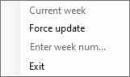

# TaskTray Weeknumber Display

TaskTrayWeek is a small Windows tray application for quick week-number lookups.

The tray icon shows the current week number using Monday as the first day of the week and the first-four-day week rule.

## Tray Menu

Right-clicking the tray icon opens a menu with:

1. `Force update` refreshes the week number shown in the tray icon.
2. `Get date from week` accepts a week number from `1` to `53`. Press Enter to show the Monday for that week in the current year.
3. `Get week from date` accepts a date using the current Windows culture. Press Enter to show the week number for that date.
4. `Start on boot` toggles whether TaskTrayWeek starts when the current Windows user signs in.
5. `Exit` closes the application.

Invalid input is shown directly in the input field:

- Invalid week numbers show `Week must be 1-53`.
- Invalid dates show `Use DD-MM-YYYY`.

## Startup Behavior

The `Start on boot` option writes to the current user's Windows startup registry key:

`HKEY_CURRENT_USER\SOFTWARE\Microsoft\Windows\CurrentVersion\Run`

This does not require administrator permissions.

## Requirements

- Windows
- .NET 10 runtime, unless using a self-contained release build
