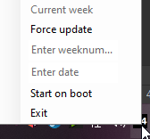

# TaskTray Weeknumber display
A simple application in the tasktray that helps with week-related information. The application was mostly created to aid with day-to-day tasks in my project management life, where the weeknumber is super relevant, but who the hell can remember the week numbers? 
## Icon
The icon shows the current weeknumber following the ISO8601 standard

## Right click
Right clicking gives you the option to:

1. Force update the week displayed in the trayicon
2. Enter a weeknumber (Press enter) that will give you date of the monday in that week
3. Enter a date (Format: DD-MM-YYYY) and press enter. You will get the week number back
4. Click the "Start on boot"-button. If program is launched as administrator, the program will add itself to bootup

